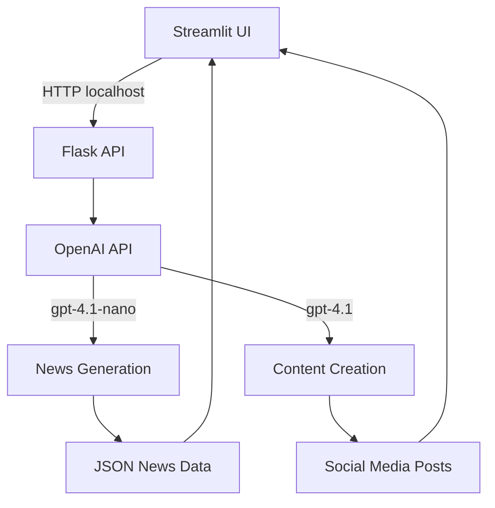

# 📰 From Headlines to Hashtags

[](https://streamlit.io/)
[](https://flask.palletsprojects.com/)
[](https://openai.com)
[](https://python.org)
[](LICENSE)

**A Social Media Content Generator — Powered by OpenAI ChatGPT 🤖**

✨ Dreamed, Designed & Delivered by **Shaid** | Guided by **Social Eagle** 🦅

Transform today's breaking news into engaging social media content with AI-powered precision. No external news APIs required - everything runs on GPT intelligence.

## 🌟 Overview

**From Headlines to Hashtags** is an intelligent social media content generation platform that converts fresh news headlines into platform-optimized social posts. The application leverages OpenAI's latest GPT models to fetch, analyze, and transform news into engaging content for your social media strategy.

### 🎯 What It Does
- Fetches fresh headlines from the last 2 days using GPT intelligence
- Generates platform-specific social media posts
- Creates multi-post series and threaded content
- Provides sentiment analysis and content strategy insights
- Offers dark/light mode with adaptive UI

## 📱 Features

### 📰 Intelligent News Generation
- **GPT-Powered Headlines**: No external APIs - 100% GPT-generated fresh news
- **Country & Category Filtering**: Targeted news based on your preferences
- **Real-Time Updates**: Get news from today or the last 2 days
- **JSON Structured Output**: Clean, organized news data

### 🎨 Content Creation Suite
- **Platform-Specific Posts**: Optimized for Twitter, LinkedIn, Facebook, Instagram
- **Character Limit Handling**: Automatic optimization for each platform
- **One-Click Generation**: Transform articles into posts instantly
- **Custom Tone & Style**: AI adapts to your brand voice

### 🧵 Series & Thread Builder
- **Multi-Post Threads**: Create engaging 1/n, 2/n style series
- **Connected Narratives**: Link multiple articles into cohesive stories
- **Thread Optimization**: Perfect for Twitter and LinkedIn engagement
- **Story Arc Generation**: AI creates compelling narrative flows

### 📊 Analytics & Strategy
- **Sentiment Analysis**: Understand the emotional tone of news
- **Content Themes**: Identify trending topics and themes
- **Posting Recommendations**: Strategic timing and frequency advice
- **Engagement Predictions**: AI-powered engagement forecasting

### 🎨 User Experience
- **Dark/Light Mode**: Instant theme switching with full UI adaptation
- **Responsive Design**: Works seamlessly on desktop and mobile
- **Sticky Footer**: Personalized branding and credits
- **Intuitive Navigation**: Clean, user-friendly interface

## 🏗️ Architecture



### 🔧 Technical Stack
- **Frontend**: Streamlit with custom CSS and responsive design
- **Backend**: Flask RESTful API with structured endpoints
- **AI Engine**: OpenAI GPT-4.1 and GPT-4.1-nano models
- **Data Flow**: JSON-based communication between services

### 🚀 API Endpoints

| Endpoint | Method | Description |
|----------|---------|-------------|
| `/health` | GET | Health check status |
| `/generate_news` | GET | Fetch fresh news with country/category filters |
| `/create_social_content` | POST | Generate platform-specific posts |
| `/create_content_series` | POST | Create multi-post threads |
| `/analyze_news` | POST | Sentiment analysis and strategy insights |

## 🚀 Quick Start

### Prerequisites
```bash
Python 3.8+
OpenAI API Key
pip (Python package manager)
```

### Installation

1. **Clone the repository**
```bash
git clone https://github.com/Shaidhms/headlines-to-hashtags-using-streamlit-flaskapi.git
cd headlines-to-hashtags-using-streamlit-flaskapi
```

2. **Install dependencies**
```bash
pip install -r requirements.txt
```

3. **Environment Setup**
Create a `.env` file in the project root:
```env
OPENAI_API_KEY=sk-xxxxxxxxxxxxxxxxxxxxxxxx
NEWS_API_PORT=5001
```

4. **Start the Application**

**Terminal 1** - Start Flask API:
```bash
python flask_api.py
```

**Terminal 2** - Start Streamlit App:
```bash
streamlit run app.py
```

5. **Access the Application**
- **Flask API**: http://127.0.0.1:5001
- **Streamlit UI**: http://localhost:8501

## 📦 Dependencies

```python
streamlit>=1.28.0
flask>=2.0.0
openai>=1.0.0
python-dotenv>=0.19.0
requests>=2.28.0
pandas>=1.5.0
```

Create a `requirements.txt` file:
```txt
streamlit>=1.28.0
flask>=2.0.0
openai>=1.0.0
python-dotenv>=0.19.0
requests>=2.28.0
pandas>=1.5.0
```

## 🖥️ User Guide

### 📰 Fetch News
1. **Select Parameters**: Choose your target country and news category
2. **Generate Headlines**: Fetch the latest news from the past 2 days
3. **Review Articles**: Browse through AI-generated news summaries
4. **Select Content**: Send articles to the content creation workflow

### 📝 Create Content
1. **Article Selection**: Selected article appears at the top of the interface
2. **Platform Choice**: Choose target social media platform
3. **Generate Posts**: AI creates optimized content with proper character limits
4. **Customize**: Edit and refine the generated content

### 🧵 Series Creation
1. **Multi-Select**: Choose 2 or more related articles
2. **Thread Generation**: AI creates connected, threaded content
3. **Review Series**: Check the flow and narrative structure
4. **Export**: Copy individual posts or the entire thread

### 📊 Analytics Dashboard
1. **Sentiment Analysis**: Understand the emotional tone of your content
2. **Theme Identification**: Discover trending topics and themes
3. **Strategy Insights**: Get AI-powered posting recommendations
4. **Performance Predictions**: Forecast engagement potential

## 🧠 AI Models & Usage

### GPT-4.1-nano
- **Purpose**: Fast, cost-effective news generation
- **Use Case**: Headlines, summaries, and basic content
- **Benefits**: Low latency, reduced API costs

### GPT-4.1
- **Purpose**: High-quality content generation
- **Use Case**: Social posts, series, and strategic analysis
- **Benefits**: Better creativity, nuanced understanding


## 🔧 Configuration

### Environment Variables
```env
# Required
OPENAI_API_KEY=your_openai_api_key_here
NEWS_API_PORT=5001

# Optional
DEBUG=False
MAX_NEWS_ITEMS=10
DEFAULT_COUNTRY=us
DEFAULT_CATEGORY=general
```

### Customization Options
- **Theme Colors**: Modify CSS variables in the Streamlit app
- **Model Selection**: Configure GPT models in the Flask API
- **Platform Limits**: Adjust character limits for different platforms
- **Branding**: Update footer and header information

## 🧪 Troubleshooting

### Common Issues

**Blank Articles Generated**
- Check OPENAI_API_KEY validity and permissions
- Verify internet connection and API accessibility

**Duplicate Titles in UI**
- Remove old `st.title()` calls if using custom HTML headers
- Check for multiple title declarations

**Footer Overlapping Content**
- Maintain proper spacer elements
- Adjust bottom padding in CSS

**API Timeouts**
- Increase timeout values in `call_api()` function
- Consider using gpt-4.1-nano for faster responses

**High API Costs**
- Use gpt-4.1-nano for news generation
- Reserve gpt-4.1 for final content creation

## 🗺️ Roadmap

### Phase 1: Enhanced Export Options
- [ ] Save generated posts to CSV/Excel
- [ ] Notion API integration
- [ ] Google Docs export
- [ ] Direct social media publishing

### Phase 2: Visual Content
- [ ] AI-generated image suggestions
- [ ] Royalty-free stock photo integration
- [ ] Video content suggestions

### Phase 3: Advanced Features
- [ ] Multi-language content generation
- [ ] Platform-specific hashtag recommendations
- [ ] Competitor analysis integration
- [ ] Content calendar planning

## 🤝 Contributing

We welcome contributions! Here's how you can help:

1. **Fork the repository**
2. **Create a feature branch**: `git checkout -b feature/amazing-feature`
3. **Make your changes** and test thoroughly
4. **Commit your changes**: `git commit -m 'Add amazing feature'`
5. **Push to the branch**: `git push origin feature/amazing-feature`
6. **Open a Pull Request**

### Contribution Guidelines
- Follow PEP 8 style guidelines
- Add comments for complex functions
- Test API endpoints thoroughly
- Update documentation for new features
- Maintain backward compatibility

## 📊 Performance Metrics


## 📄 License

This project is licensed under the MIT License 

### Attribution
Please keep credit to **Shaid** & **Social Eagle** 🦅 visible in any derivative works.

## 🙏 Acknowledgments

- **Creator**: Shaid - Vision, Design, and Development
- **Mentor**: Social Eagle 🦅 - Strategic Guidance and Direction
- **AI Platform**: OpenAI ChatGPT - Powering the intelligence behind the app
- **Community**: Streamlit and Flask communities for excellent frameworks

## 📞 Contact & Support

- **GitHub Issues**: [Report Issues](https://github.com/Shaidhms/headlines-to-hashtags-using-streamlit-flaskapi/issues)
- **Discussions**: [GitHub Discussions](https://github.com/Shaidhms/headlines-to-hashtags-using-streamlit-flaskapi/discussions)
- **Creator**: Connect with Shaid on [GitHub](https://github.com/Shaidhms)

## 🌟 Star History

[](https://star-history.com/#Shaidhms/headlines-to-hashtags-using-streamlit-flaskapi&Date)

---

**Made with ❤️ by Shaid | Guided by Social Eagle 🦅**

*"Turn today's news into tomorrow's engagement"*
